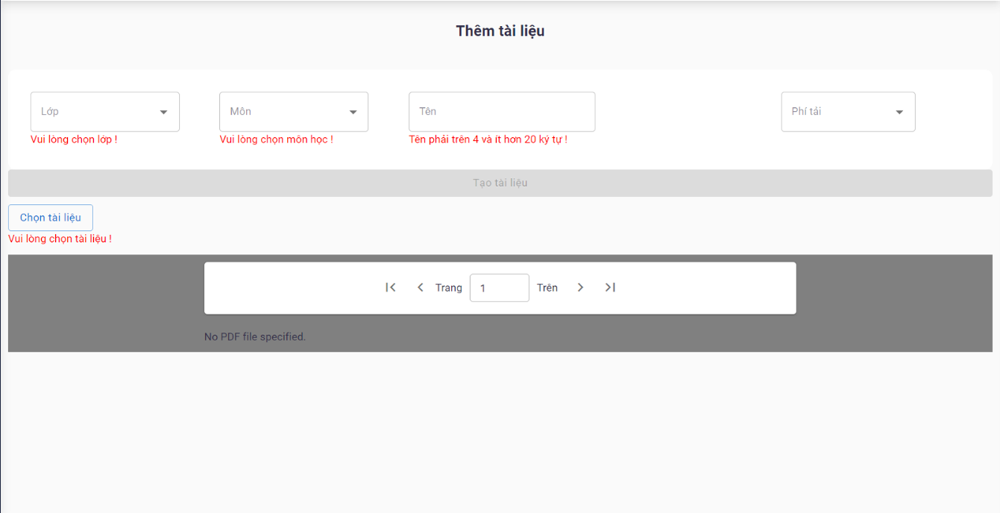
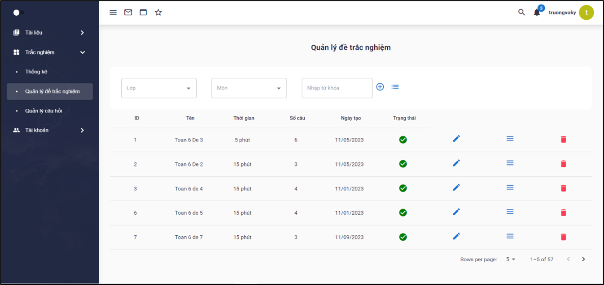
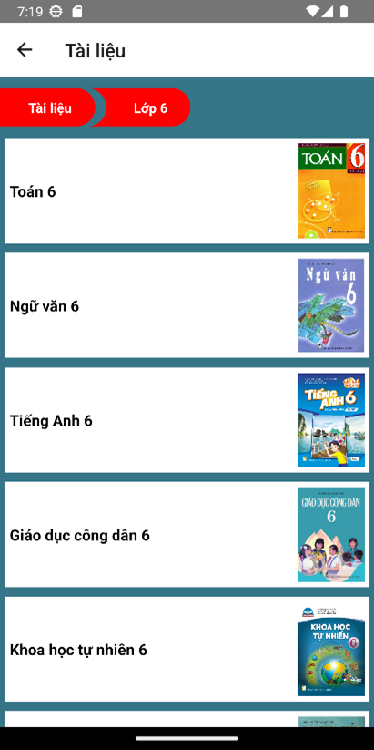
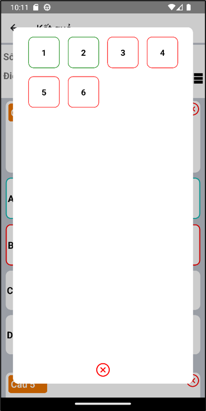

# SYSTEM OF LECTURES AND MULTIPLE-CHOICE EXAMS ON MOBILE DEVICES 
## Introduction
## Languages and technologies used
1. Java (Spring Boot)
2. MySQL
3. HTML, CSS 
4. JavaScript (ReactJS, React Native)
## Softwares used
1. XAMPP (A web server by Apache Friends)
2. Spring Tool Suite 4 (IDE to develop Spring applications)
3. Visual Studio Code (code editer)
4. Google Chrome (was used to run the website of project)
5. Android Studio (was used run mobile application on mobile device)
## Getting into the project
### Admin Website
1. Login page

2. Home page

3. Account Manage page

4. Filter account by name and email

5. Block account

6. Role grant

7. Statistical data of account

8. Document manage page

9. Filter document

10. Block document

11. Add document

12. Edit document

13. Delete document

14. Download numbers of documents 

15. Question manage

16. Filter question

17. Detail question

18. Add question

19. Exam manage

20. Filter exam

21. Add exam

22. Statistical data of exams

### Mobile Application
1. Login screen

2. Home screen
   

        

            
            
 

            
        

        
 

        

            
            
 

            
        

    

3. Document screen
    

        

            
            
 

            
        

        
 

        

            
        

    

4. Take exam screen
   

        

            
            
 

            
        

        
 

        

            
            
 

            
        

        
 

        

            
            
 

            
        

 

5. asdasd
   

        

            
            
 

            
        

        
 

        

            
        

    
  
6. asdasd
   
7. fsfs
   
8. 
   
 
  

